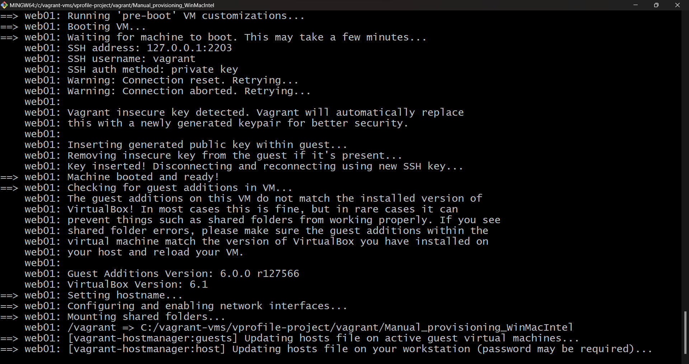
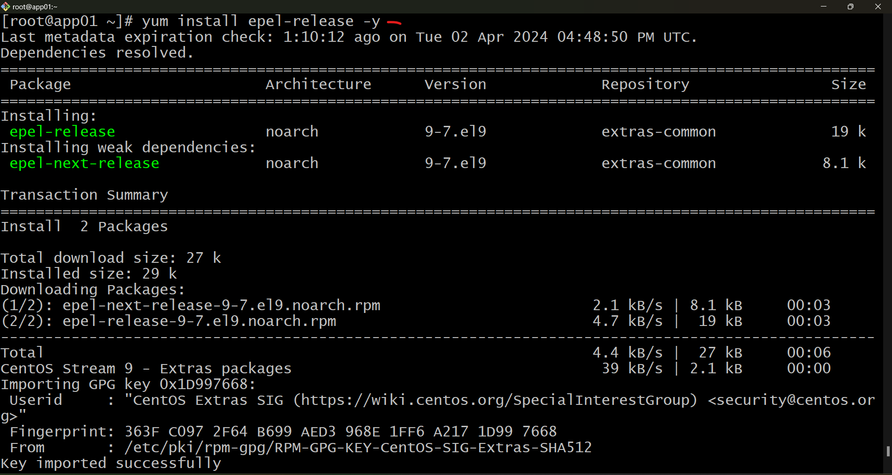
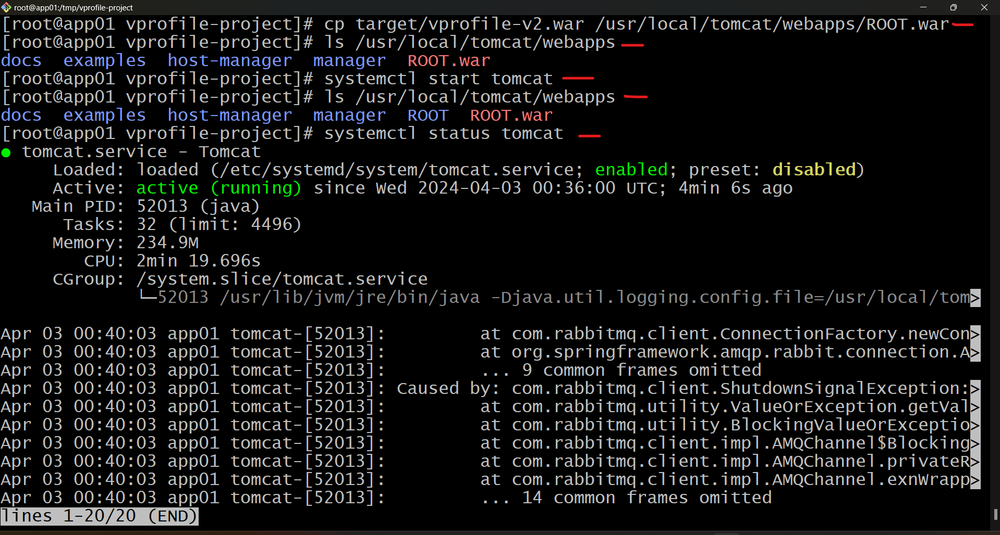

# V-PROFILE-PROJECT
## Vagrant profile project setup manual &amp; automated


### SETUP WEB APPLICATION STACK


Setting up the vagrant profile project locally involves deploying and refactoring a stack on AWS, containerizing applications and deploying them on a kubernetes cluster. This project aims to establish a local lab environment.

Tools needed:

- Hypervisor: oracle VM virtualbox

- Automation: Vagrant 

- CLI: Git Bash

- IDE: Sublime Text (or Vs Code, Notepad++)

Using Oracle VM VirtualBox, Vagrant, GitBash for automation and version control, and an IDE like Sublime text, we'll create and manage our project environment efficiently.


 __ARCHITECTURE OF PROJECT SERVICES__


- Nginx

- Tomcat

- RabbitMQ

- Memcached

- mySQL service

__ARCHITECTURE DESIGN OF AUTOMATED SETUP__

We have:

- Vagrant

- Virtual box

- Git bash and also some scripts and commands.


__FLOW OF STACK__


The term "stack" refers to a collection of services operating in tandem to deliver a unified experience. In our setup, we'll leverage Nginx for load balancing.

Nginx, similar to Apache httpd, is a commonly used web service for facilitating load balancing. Within one of our virtual machines (VMs), we'll deploy Nginx and configure it to swiftly route incoming requests to the Apache Tomcat server.

Apache Tomcat, a Java-based web application service, will host our application. Users will interact with this application, login with credentials, and have their login details stored in a MySQL database.

To facilitate seamless communication between components, we'll utilize RabbitMQ, acting as a message broker to link various parts of the application.

When users access the application hosted on Tomcat/Apache, their login credentials trigger MySQL queries to retrieve user information stored in the database. Before reaching the MySQL database, requests will pass through a memcache service, a database caching layer connected to MySQL.

MySQL will store user information, initially fetching data from the database to Tomcat and subsequently caching it in the memcache service. This caching mechanism ensures quicker access to data upon subsequent requests, similar to browser caching for web content.

Automating our virtual machine setup, we'll employ Vagrant to interface with Oracle VM VirtualBox, the hypervisor, to provision virtual machines automatically. Utilizing bash scripts or commands, we'll configure and deploy our services within these virtual environments.


Vagrant--virtualbox--Git Bash==Nginx, Apache, Tomcat, Memcached, RabbitMQ, mySQL.

So we will automatically create virtual machines from Vagrant, Virtual machines for Nginix, Apache Tomcat, Memcache, RabbitMQ and mySQL


 __FLOW OF EXECUTION__

- Set up tools mentioned above

- Clone source code

- Cd into the vagrant directory in the source code

- Bring up vms automatically from that background file

- Validate all our virtual machines

- set up all the services one by one(mySQL, memcached, RabbitMQ, tomcat, nginx) Build application or java application and deploy it.

- verify from your browser


__provisioning services__

- Nginx: web service

- Tomcat: Application server

- RabbitMQ: Broker/queuing agent

- Memcache: Db caching

- Elastic search: indexing/search service

- mySQL: SQL database.


Let's bring up the virtual machine

Get into the folder where you have the code and cd into vagrant and you have manual provisioning.

`cd /c/vagrant-vms`

`cd vprofile-project`

`cd vagrant/`

`ls`

`cd manual_provisioning_WinMacIntel`


if you encounter error like this:


 `"unknown configuration section 'hostmanager' means the vagrant-hostmanager plugin needs to be installed"`

 `vagrant plugin install vagrant-hostmanager`

 

 Then try running `vagrant up` again, if you still encounter issues consider checking the following.


Comment hostmanager section: Since you're not using the hostmanager plugin currently, remove the following lines from your Vagrantfile:


The `Vagrant.configure("2")` line specifies you're using Vagrant version 2 syntax.

The `config.vm.define` blocks define individual virtual machines with their configurations:

`box`: Specifies the base virtual machine image (you're using CentOS Stream 9).

`hostname`: Sets the hostname for the VM.

`network`: Configures the network interface with a static IP address (192.168.56.X for each VM).

`provider "virtualbox"`: Defines the provider as VirtualBox.

`vb.memory`: Allocates memory (600MB for DB/Memcache/RabbitMQ, 800MB for Tomcat)


Install vagrant-hostmanager (optional): If you decide to use the hostmanager functionality later, install the plugin using:

`vagrant plugin install vagrant-hostmanager`


Then, uncomment the `config.hostmanager` section in your Vagrantfile. 


Run `vagrant up`: With the hostmanager section uncommented, you can now run vagrant up to provision and start your virtual machines.





To list all the available vms run `vagrant status`

`db01` database

`mc01` memcache

`app01` application

`web01` website

`rmq01` rabbit mQ


login to all the vms one by one

`vagrant ssh db01`


let's check if it's able to connect. its just a ping test to see whether the name resolve to the ip address or not.

`ping web01 -c 4`  simulates sending four echo requests to a host named "web01" and waits for a response. This helps test the network connectivity between your machine and web01. 

so `db01` connected to `web01`


Stack means where you have combination of multiple services. it is different from a cluster.

Cluster is a group of systems running the same service.

Update OS with the latest patches

`yum update -y`

Set repository so we can get access to more packages

`yum install epel-release -y`

Install  mariaDB package

`yum install git mariadb-server -y` (to clone the source code)

Start and enable mariadb-server

`systemctl start mariadb`

`systemctl enable mariadb`

`systemctl status mariadb`


Lets run a command

`mysql_secure_installation`

This is a script or a command created by the mariadb mysql. it will ask you some question to secure the database.

It will ask for current password for root, but this is not the root user of linux, this is the root user of the database mysql service .

we dont have any root password for mysql , we just installed it so we are just going to hit enter .

then set root password 


__LET'S SET UP THE DATABASE.__

Service is running, but the database is not created

we will login into the database and switch to root user.

`vagrant ssh db01`

`sudo -i`

we will be storing data in the database named __accounts__ and all should end with semicolon(__;__)

__%__ percent in the database means from remotely.

so admin user of the database should be able to connect from remote machine that is from app zero and it should be able to connect.

`mysql_secure_installation`

`mysql -u root -pokekeoge1`

`create database accounts;`

`show databases;`

`grant all privileges on account.* TO 'admin'@'%' identified by 'okekeoge1' ;`

`FLUSH PRIVILEGES;`

`exit;`


FLUSH PRIVILEGES means to reload.


we clone the source code
 
`git clone -b main https://github.com/hkhcoder/vprofile-project.git `

`ls`

`cd vprofile-project`


lets run our login command with the database named __accounts__ and input, then enter the database and show the tables created, exit and then restart mariadb service

`mysql -u root -pokekeoge1 accounts < src/main/resources/db_backup.sql `

`mysql -u root -pokekeoge1 accounts`

`show tables;`

`exit;`


`systemctl restart mariadb`

`systemctl status mariadb`


__MEMCACHE SETUP__

Login to the memcached vm and switch to root user

`vagrant ssh mc01`

`sudo -i`

We have to install memcache, start the service and make a configuration change and restart memcache service

Set the repository to have access to more packages

`yum install epel-release -y`


`yum install memcached -y`


`systemctl start memcached`

`systemctl enable memcached`


SED stands for stream editor, used for manupulating text files. it works by processing text data line by line and applying commands to edit the contents.

__key functionalities:__

__Search and Replace:__ Sed excels at finding specific patterns (words, phrases) within a text file and replacing them with your desired substitutions. This is particularly useful for making bulk edits across a file.

__Line Editing:__ It allows you to insert, delete, or modify lines based on certain criteria. You can select lines by line numbers, patterns, or their position relative to other lines.

__Filtering:__ Sed can be used to filter out specific lines from a file based on patterns. This helps in extracting relevant information or removing unwanted data.


some services by default listens only for local connection, i.e if the service is running on a different machine and there is some other services like any application service or any other service that is connecting to that machine 


`sed -i 's/127.0.0.1/0.0.0.0/g' /etc/sysconfig/memcached`

`vim/etc/sysconfig/memcached`

We changed the IP to 0.0.0.0, that means all the ip address listens from all the ip addresses like in linux we have star(*) which means all in networking. 0.0.0.0(4) zeros means all the IPv4.


Whenever we make a configuration change, we need to restart the server.

After we restart the service, check its status


`systemctl restart memcached`

`systemctl status memcached`


__RABBITMQ SETUP__

Login to the rabbitmq vm and switch to root user.

`vagrant ssh rmq01`

`sudo -i`

Update the server 

`yum update -y`


`yum install centos-release-rabbitmq-38`


I encountered this errors that indicated that yum is unable to download the required packages for installing centos-release-rabbitmq-38, then Checked the `/etc/resolv.conf` file to see the configured DNS servers and changed the DNS to 8.8.8.8. 


`vim /etc/resolv.conf`

`yum install centos-release-rabbitmq-38`


`yum --enablerepo=centos-rabbitmq-38 -y install rabbitmq-server`

Enable the repository and install rabbitmq from it


`systemctl start rabbitmq-server`

`systemctl enable rabbitmq-server`

`systemctl status rabbitmq-server`


For the profile application

`sh -c 'echo "[{rabbit, [{loopback_users,[]}]}]." > /etc/rabbitmq/rabbitmq.config'`

`cat /etc/rabbitmq/rabbitmq.config`


Now we will use rabbitmq commamnd `rabbitmqctl add user test and password test`

`rabbitmqctl add_user test test`


And then for the test user, we are going to set a tag administrator.

`rabbitmqctl set_user_tags test administrator`


It will be used by our profile application to connect to rabbitmq servers.

If you change the user name and password make sure you take a note of that, after that restart your rabbitmq-server, check it status.

Reason we check the service after restarting is because when we make configuration changes, sometimes we make mistakes. And if there is any syntax mistakes in the configuration , the service won't start and it will tell you the syntax error.

`systemctl restart rabbitmq-server`

`systemctl status rabbitmq-server`


__APPLICATION SETUP__

__TOMCAT AND DEPLOYING OUR APPLICATION ON IT__


Tomcat is an open-source web server. The Apache Software Foundation has developed it. It is used widely for hosting Java-based applications on the web. It is built on Java technologies.
 


First we will set up the tomcat service and then deploy our application vagrant profile application.

Tomcat will be a different setup compared to what we have done so far, e.g mysql, memcached, rabbitmq and apache httpd. We installed them through package managers YUM. we get the systemctl command to manage the services, start, stop, enable, restart, reload, status etc. But in Tomcat there's no such thing with the version we are using.

For tomcat we have a dependency, java. we are going to install java 11, after that we will use wget command to download a tarball of tomcat.

__tarball__ also known as __tar archive__ contains everything of tomcat and when extracted you get a folder:

- configuration files

- startup scripts

- logs

- binaries

Why Tomcat is different from the services we have installed so far is because the services that we installed through YUM, APT, will extract their files in the proper linux file system structure, like log files will go to /var/log/ directory, startup scripts will go to systemd, configuration will go to etc.


Tomcat is also from Apache, Apache is their open source community. Apache is the name of the organization, Tomcat is the service or their product


Update the OS

`yum update -y`


Set repository

`yum install epel-release -y`




Install java11

`yum install java-11-openjdk java-11-openjdk-devel -y`


__Difference between JDK and JRE__

__JDK (Java Development Kit)__ and __JRE (Java Runtime Environment)__ are both essential components for working with Java applications, but they serve different purposes


__Think of JRE as a kitchen.__ It has all the essential tools and ingredients (libraries) you need to prepare a meal (run a Java program).

__JDK is like a complete chef's toolkit.__ It includes the kitchen (JRE) along with knives, pots, pans, and recipe books (development tools) to help you cook delicious meals (develop Java applications) from scratch.

In summary:

You need __JRE__ to run Java programs.

You need __JDK__ to develop Java programs.


We will install more dependencies (git, maven, wget)

- Git to clone the source code

- maven which we will use to build our artifact

`yum install git maven wget -y`


We will need a home directory for Tomcat and we  will need a user to run the Tomcat service.

Go to tmp folder

`cd /tmp/`

Go to your browser search for tomcat 9 download, and get the download link, right click on the __tar.gz link__ and copy the link using wget to download the files.


`wget https://dlcdn.apache.org/tomcat/tomcat-9/v9.0.87/bin/apache-tomcat-9.0.87.tar.gz`


`ls` to see the tarball


Lets extract the tarball

`tar xzvf apache-tomcat-9.0.87.tar.gz`

`


Add user

`useradd --home-dir /usr/local/tomcat --shell /sbin/nologin tomcat`


So copy everything from the folder to /usr/local/tomcat/ run ls -ld <filename_or_directory>, the output will typically include several fields separated by spaces or tabs then give it ownership

`cp -r apache-tomcat-9.0.87/* /usr/local/tomcat/`

`ls -ld /usr/local/tomcat/`

`chown -R tomcat.tomcat /usr/local/tomcat/`

`ls -ls /usr/local/tomcat/`


Setup systemctl command for tomcat, make sure you give the right name and right path of the file

`vi /etc/systemd/system/tomcat.service`

```
[Unit]
Description=Tomcat
After=network.target

[Service]
User=tomcat
WorkingDirectory=/usr/local/tomcat
Environment=JRE_HOME=/usr/lib/jvm/jre
Environment=JAVA_HOME=/usr/lib/jvm/jre
Environment=CATALINA_HOME=/usr/local/tomcat
Environment=CATALINE_BASE=/usr/local/tomcat
ExecStart=/usr/local/tomcat/bin/catalina.sh run
ExecStop=/usr/local/tomcat/bin/shutdown.sh
SyslogIdentifier=tomcat-%i

[Install]
WantedBy=multi-user.target

```


whenever you make changes to any file, you need to run this command `systemctl daemon-reload`. This command instructs the systemd service manager to reload its configuration files. This means systemd re-reads all unit files, reflects the latest configurations without directly affecting running services.

`ls /etc/systemd/system/`

`systemctl daemon-reload`

`systemctl start tomcat`

`systemctl enable tomcat`


`ls /usr/local/tomcat/`

`ls /usr/local/tomcat/bin`

`ls /usr/local/tomacat/conf`

`ls /usr/local/tomcat/lib`

`ls /usr/local/tomcat/logs`


So tomcat services is up and running so the next step will be to deploy our application.

Clone the source code written by the developers

`git clone -b main https://github.com/hkhcoder/vprofile-project.git`

Cd into the vprofile folder

`cd vprofile-project/`

`ls`


`ls src/main/resources/`

`vi src/main/resources/application.properties`


This file contains the backend service information 


To build the application, read the source code and build the artifacts. Artifact is a deployable product. Artifacts are archive like zip,tar etc.
in java the archive format is WAR, JAR, EAR

`mvn install` 


When you do `ls` you will find an extra folder `target`

`ls target/`

Then stop the tomcat service to deploy the artifact. Remove the default application. In this folder you will find a folder named ROOT thats the default tomcat application.Remove it and deploy our artifact

`ls /usr/local/tomcat/webapps/`

`rm -rf /usr/local/tomcat/webapps/ROOT`

`ls /usr/local/tomcat/webapps/`


Copy the artifact and start the tomcat service. After restarting the service you will see a folder with the name ROOT. Tomcat will extract it with the same name, it becomes your default application

`cp target/vprofile-v2.war /usr/local/tomcat/webapps/ROOT.war`

`ls /usr/local/tomcat/webapps`

`systemctl start tomcat`

`ls /usr/local/tomcat/webapps`

`systemctl status tomcat`




__NGINX SETUP__

Login to nginx vm 

`vagrant ssh web01`

`sudo -i`


Update OS 

`apt update && apt upgrade`


Install nginx

`apt install nginx -y`


Create nginx config file 

`vi /etc/nginx/sites-available/vproapp`

```
upstream vproapp{
    server app01:8080;
}
server {
    listen 80;
    location / {
        proxy_pass http://vproapp;
    }
}

```

When you access any website from the browser, by default it goes on port 80 for http and port 4434 for https

Sites-available is where you have your configuraton while sites-enabled is where you have a link


Remove nginx default config

`rm -rf /etc/nginx/sites-enabled/default`


Create link to activate website

`ln -s /etc/nginx/sites-available/vproapp /etc/nginx/sites-enabled/vproapp`


Restart nginx

`systemctl restart nginx`


The error encountered, shows that the `listen` directive in my Nginx configuration file was missing a semicolon (;) at the end.


Destroy all the vm's 

`vagrant destroy --force`


__AUTOMATED CODE AND EXECUTION__

We will automate the entire set up through the vagrant file by using provisioning.

We will run just vagrant up command and it wil bring up all the vm's.

All the vm's will be provisioned automatically, also all the services Nginx, tomcat, rabbitMQ, memcache and mysql will also be provisioned automatically.

We will have a bash script that will be executed automatically.


In our repository we have a "vagrant" folder.


__CODE__


__EXECUTION__

`vagrant up`


